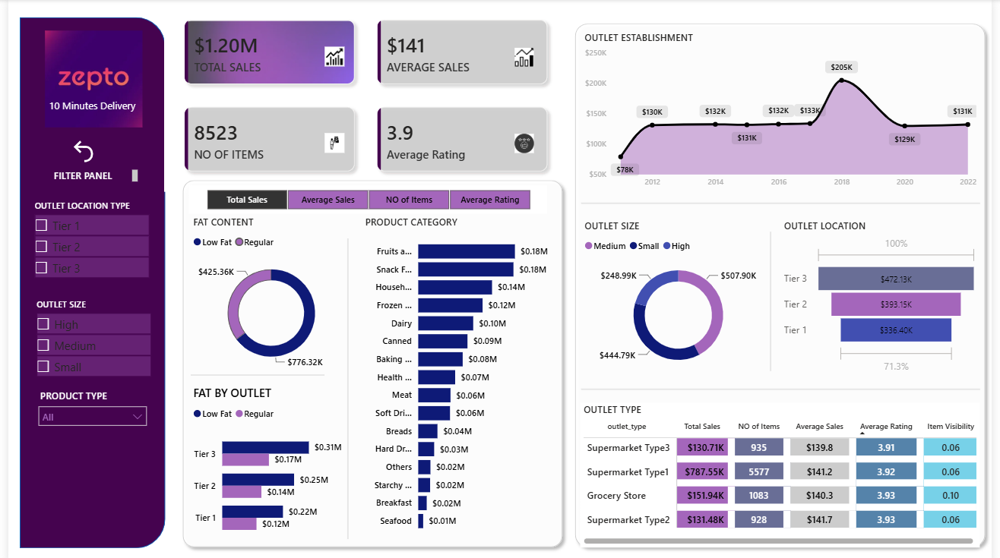

# zepto_sales_analysis
---
# 🛒 Zepto Sales Analysis using PostgreSQL & Power BI

An end-to-end data analytics project that transforms raw grocery sales data into actionable business insights using PostgreSQL and Power BI.

The project follows a complete analytics workflow including data cleaning, transformation, reporting, and dashboard development to help analyze sales performance, outlet efficiency, product trends, and customer behavior.

---

## 📊 Dashboard Preview

## Project Objectives

- Analyze overall sales performance.
- Compare outlet performance across locations and outlet sizes.
- Identify top-performing product categories.
- Evaluate sales by product fat content.
- Monitor outlet establishment trends.
- Build an interactive dashboard for business users.

## 📖 Project Overview

This project analyzes grocery sales data from Zepto to identify key business insights.

The workflow includes:

- Data Cleaning
- Data Transformation
- Data Modeling
- Business KPI Development
- Interactive Dashboard Creation

## Project Workflow
Raw CSV Dataset
        │
        ▼
Bronze Layer
(Raw Import)
        │
        ▼
Silver Layer
(Data Cleaning & Standardization)
        │
        ▼
Gold Layer
(Reporting Views)
        │
        ▼
Power BI Dashboard
The final dashboard enables users to explore sales performance using dynamic filters and interactive visualizations.

## Dashboard Features

### KPI Cards

- Total Sales
- Average Sales
- Total Items
- Average Rating

### Visualizations

- Sales by Product Category
- Sales by Outlet Size
- Sales by Outlet Type
- Sales by Outlet Location
- Sales Trend by Establishment Year
- Fat Content Analysis

### Filters

- Outlet Location
- Outlet Size
- Product Category
- 
## Key Metrics

1. Essential Data Points Driving Zepto's Success
2. Total Sales: Overall revenue generated by Zepto.
3. Total Number of Items: Total quantity of items sold.
4. Average Sales: Average value per order.
5. Average Rating: Customer satisfaction rating.
6. Outlet Establishment Year: Year when outlets were established.
7. Outlet Location Type: Location of outlets (e.g., Tier 1, Tier 2, Tier 3).
8. Outlet Type: Type of outlet (e.g., Supermarket Type1, Supermarket Type2).
9. Outlet Size: Size of outlets (e.g., Small, Medium, High).
10. Item Type: Category of items sold (e.g., Fruits, Snacks, Frozen Food).
11. Fat Content: Fat content of items (e.g., Low Fat, Regular).
---
## Key Insights

---  Highlights from Zepto's Performance Analysis

1. Overall Growth: Zepto has stagnation growth over the quarters with respect to sales with an exceptional growth in year-quarter '2023-Q1'(~54%).
2. Customer Satisfaction: The average rating of '4' indicates high customer satisfaction.
3. Outlet Performance: 'Supermarket Type1' outlets have been the top performers in terms of total sales with a market share of ~66% and ~65% of number of items sold.
4. Item Popularity: 'Fruits and snacks' are the most popular item categories, both contributing close to 15% each to the total sales.
5. Customer Preferences: Customers in 'Tier 3' cities have shown the highest spending.
6. Type of Food: The low fat food is dominating the food category with around 64.6% of total sales.
7. Zepto Sales Analysis - Power BI Dashboard
8. Tier 3 outlets generated the highest sales.
9. Medium-sized outlets contributed the largest revenue share.
10. Regular Fat products generated higher revenue than Low Fat products.
11. Fruits and Snack Foods were the highest-selling product categories.
12. Supermarket Type 1 recorded the highest number of items sold.

## Repository Structure
datasets/
docs/
images/
scripts/
README.md
Zepto Sales Analysis.pbix

## Author

**Divya Bansal**
## 📬Connect with Me

- LinkedIn: https://www.linkedin.com/in/divya-bansal-5782bb303/
- GitHub: https://github.com/divyabansal5509

